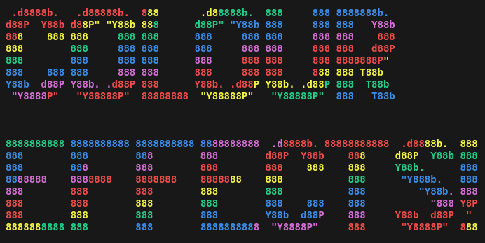

This a a project to develop a Python PyPI package that not just handles colour text output but can also apply sweet colour effects to your text.

# What do?
* Study colour outputting Python libraries to learn their secrets [write-up](./Notes/colour_output.md)
* Study Poetry, because I kinda want to learn how that works and it should ultimately make deploying a PyPI package a little bit easier