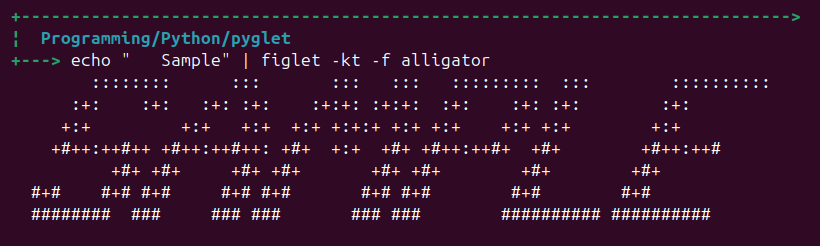
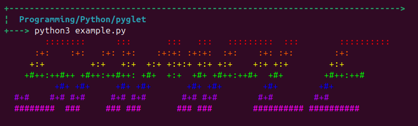
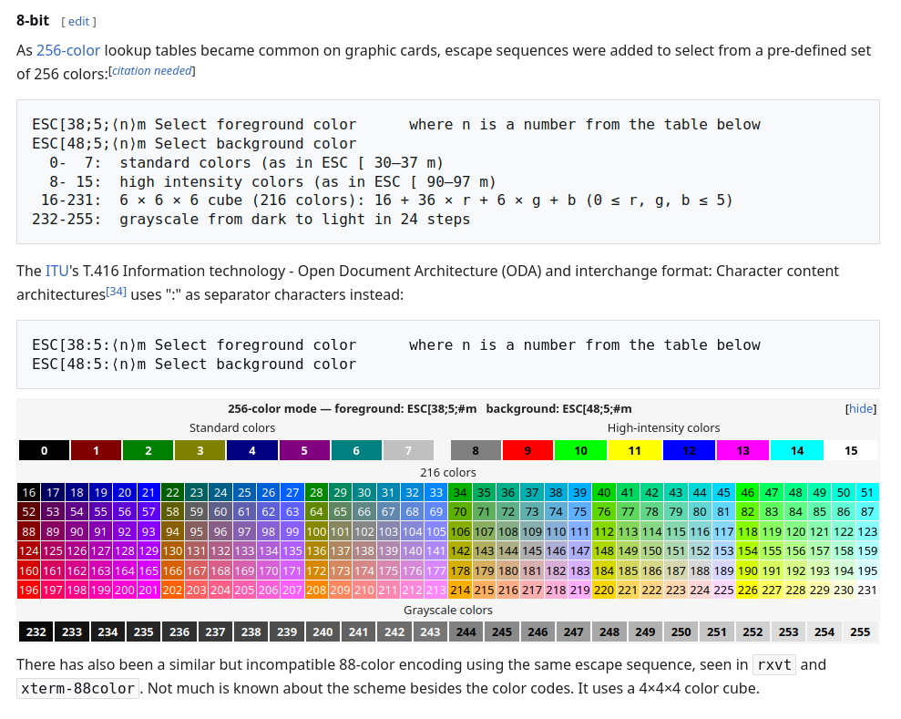

# pyglet

This a a project to develop a Python PyPI package with all the features of [figlet](http://www.figlet.org/) (which is already done in [pyfiglet](https://pypi.org/project/pyfiglet/)). **_BUT_** we're gonna add colour customisation!

So instead of having to stick to boring old regular no colour stuff like this:  

You could have something super cool like this:  

We will likely end up using colours from the 8bits ANSI escape codes:  
